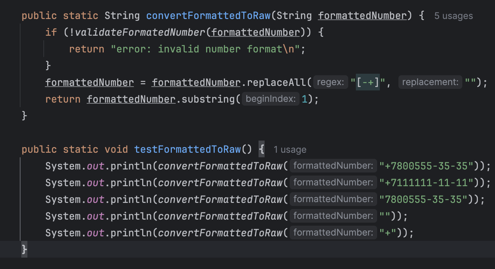

# Задание 1.
## Необходимо написать и протестировать 7 функций для валидации, конвертации и генерации телефонных номеров.
### validateRawNumber(String rawNumber): boolean
– метод  валидации телефонного номера в «сыром виде». Телефонный номер в сыром виде есть строка из десяти десятичных цифр, 
например, “8005553535“. Возвращает true, если номер валидный, иначе false.

---

### validateFormattedNumber(String formattedNumber): boolean
– метод  валидации телефонного номера в «форматированном виде». Телефонный номер в форматированном виде есть строка из десяти 
десятичных цифр, которые разделены в определенных местах дефисом, а также имеют код РФ в начале “+7” 
(7 – это одиннадцатая цифра в строке), например, “+7800555-35-35“. Возвращает true, если номер валидный, иначе false.

---

### convertRawToFormatted(String rawNumber): String
– преобразование «сырого» телефонного номера в «форматированный». Например, номер “8005553535“ будет преобразован
в “+7800555-35-35“. Возвращает полученный номер в форматированном виде. В случае, если входной номер не валидный, возвращать null.

---

### convertFormattedToRaw(String formattedNumber): String
- преобразование «форматированного» телефонного номера в «сырой». Например, номер “+7800555-35-35“ будет преобразован
- в “8005553535“. Возвращает полученный номер в форматированном виде. В случае, если входной номер не валидный, возвращать null.

---

### generateRawNumber(Random random): String
 – генерация рандомного номера в сыром виде. Результат должен быть валидным номером в сыром виде.

---

### generateFormattedNumber(Random random): String
- генерация рандомного номера в форматированном виде. Результат должен быть валидным номером в форматированном виде.

---

### generateNumbers(int count, Random random): String[][]
 – генерация множества радномных номеров в количестве count-штук. Сгенерированные номера записываются в двумерный массив,
причем в первой строке массива располагаются номера в сыром виде, а во второй строке на соответствующих позициях располагаются
те же самые номера в форматированном виде – т.е. в каждом столбце 2 одинаковых номера в разном виде. Все номера должны быть валидными.

---

> Написать сценарии тестирования всех процедур в коде.
# Задание 2.
## Необходимо написать и протестировать 4 функции для работы с IPv4-адресами
### validateIPv4(String ipv4String): boolean
– валидация ipv4-адреса, возвращает true если переданная строка является валидным ipv4-адресом, иначе false. Валидным ipv4-адресом
считается строка, которая состоит из четырех чисел в диапазоне от 0 до 255, разделенных между собой точками, например – “178.27.0.1“.

---

### generateRandomIPv4(Random random): String
– генерация случайного ipv4-адреса. Сгенерированный адрес должен быть валидным.

---

### extractAllIPv4(String text): String[]
– процедура принимает на вход строку с текстом, находит в данном тексте все валидные ipv4-адреса, извлекает их и возвращает в виде массива строк без повторений.
---
### generateRandomText(int ipv4Count, double ipv4Percentage, Random random): String
– процедура генерации текста с ipv4-адресами. Сам текст содержит ipv4Count
случайных ip-адресов, а также случайные последовательности букв, цифр, пробелов и знаков препинания. Длина текста зависит от кол-ва ipv4-адресов в нем – на 
вход передается процент ipv4-адресов от общей длины текста (примерно) – дробное число от 0 до 1 (не включая границы).
Т.е. вызов generateRandomText(10, 0.5, …) будет означать, что требуется сгенерировать текст, 50% символов которого будут составлять ipv4-адреса в количестве десяти штук.

> Протестировать методы.
